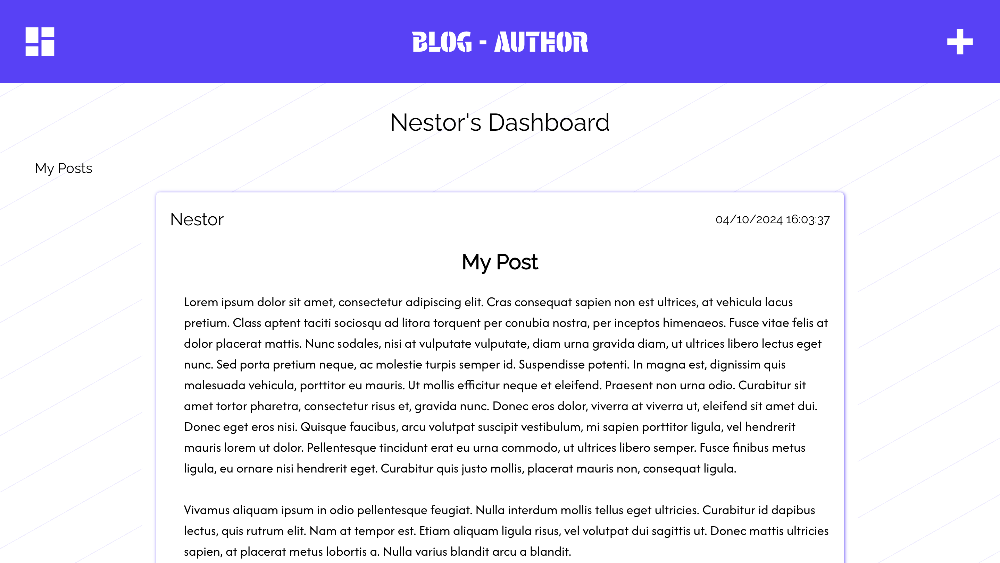

    
    
<h3>Blog API</h3>

## About

This project consists of:

<h4>API</h4>

A backend REST API to handle the Apps authentication and resources requests.

<h4>Blog-User</h4>

The first Frontend App that allows users to connect themselves to read and comment on posts.

<h4>Blog-Author</h4>

The second Frontend App which is only accessible for users considered as "Authors". They can use this App to update their posts, publish/unpublish them. This is also this app that allows user to create new posts.

### Built With

#### AND

## Getting Started

See each app installation guide in its own README file.

[API](https://github.com/NestorNebula/blog-api/tree/main/api#README.md)

[Blog-User](https://github.com/NestorNebula/blog-api/tree/main/blog-user#README.md)

[Blog-Author](https://github.com/NestorNebula/blog-api/tree/main/blog-author#README.md)

## Contributing

If you find an issue within the app or want to contribute, you can <a href="https://github.com/NestorNebula/blog-api/issues">Open an Issue</a>.

## License

## Contact

Noa Houssier - [Github](https://github.com/NestorNebula)

## Acknoledgements

- [Material Design Icons](https://pictogrammers.com/library/mdi/)
- [Faker](https://fakerjs.dev/)

(<a href='#top'>go back to the top</a>)

