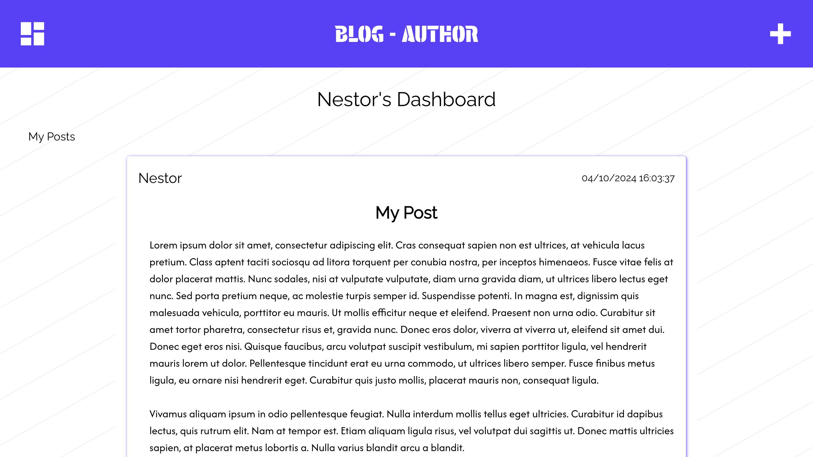

<a id="top"></a>

<div align="center">
    <a href="https://github.com/NestorNebula/blog-api/tree/api">
        
    </a>
    
<h3>Blog API - Blog-Author</h3>
</div>

## About



This app is one of two Frontend apps that can access a backend API. (See the [Project's README](https://github.com/NestorNebula/blog-api#readme))

This app allow users (once they are logged in and considering they have the "Author" role) to access their posts. They can edit them, change their published status and delete comments.

This app is also the app the author will use to create and publish new posts.

### Built With

[](https://react.dev/)
[](https://vite.dev/)
[](https://vitest.dev/)

#### AND


## Getting Started

### Prerequisites

- NPM
- The backend API running locally (Follow the instructions in the [README file](https://github.com/NestorNebula/blog-api/tree/main/api#readme))

### Installation

1. Fork the [Project repository](https://github.com/NestorNebula/blog-api)
2. Clone the forked repository to your local machine
   ```
   git clone git@github.com:<your username>/<repo name>.git
   ```
3. Update remote URL

   ```
   # SSH:
   git remote add upstream git@github.com:blog-api/<repo name>.git

   # HTTPS:
   git remote add upstream https://github.com/blog-api/<repo name>.git
   ```

4. Go to the app directory
   ```
   cd blog-author
   ```
5. Create a .env file in the project root directory with the following key

   ```
   VITE_API_URL=<url>

   # If you are running the other Frontend App
   VITE_BLOG_URL<url>
   ```

6. Install required packages
   ```
   npm install
   ```
7. Open the app in development mode
   ```
   npm run dev
   ```

If an error occurs, make sure you have done everything properly according to this guide. If you think so, you can <a href="https://github.com/NestorNebula/blog-api/issues">Open an Issue</a>.

## Usage

Once the app is up and running and considering your backend API is also running, you can connect to your author account and create new posts or update your existing ones.

## Contributing

If you find an issue within the app or want to contribute, you can <a href="https://github.com/NestorNebula/blog-api/issues">Open an Issue</a>.

## License

[](https://github.com/NestorNebula/blog-api/blob/main/LICENSE)

## Contact

Noa Houssier - [Github](https://github.com/NestorNebula)

<p align='right'>(<a href='#top'>go back to the top</a>)</p>
